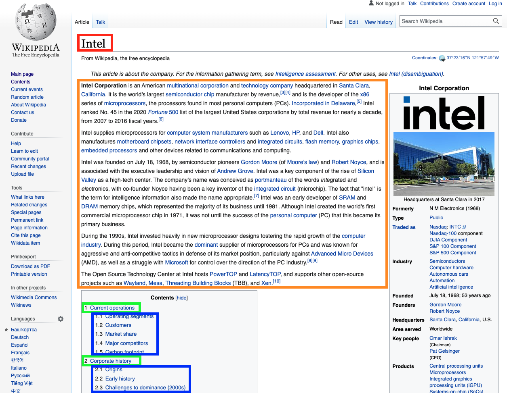

# Arek's Wikipedia Scraper v1.0.0

This scraper will pull the headings and text data from a Wikipedia page and return the data organized into JSON format. Examples for use are provided in Node.JS and Python3.

Future Development Goals:

-   Error Checking - Return an error if the Wikipedia page doesn't exist
-   Clean data better - there are still a few HTML elements included in the text of the scraped data
-   Clean up references - currently they are scraping a mix of text and HTML
-   Scrape images from each page - return URLs for each image Wikipedia provides on the page

---

## Installing and Running Locally

For whatever reason the OSU servers seem to not like keeping the scraper up for too long... You will get the best response if you run the service locally. Please follow the below steps to set up and run the scraper locally.

1. Clone files from GitHub:

```
git clone https://github.com/engstrar/WikipediaScraper.git
```

2. Install all necessary node modules:

```
nmp install express axios cheerio
```

3. Run app.js

```
node app.js
```

4. Your scraper will be hosted at _http://localhost:3619/_ unless you changed the port number at the top of the app.js file.

---

## Request Format - HTTP

All Wikipedia pages follow the same URL format *https://en.wikipedia.org/wiki/X*, where _X_ is a unique descriptor for each page. When requesting a Wikipedia page be scraped for data you will request using the query string `?page=X`, where _X_ corresponds to the page you are requesting the data for.

Example:

Wikipedia page to be scraped: *https://en.wikipedia.org/wiki/Foobar*

Send GET request to: _http://localhost:3619?page=Foobar_

---

## Response Format - JSON

When a scraping request is made the scraped data will be stored in JSON format and returned. The JSON object returned will follow this general format:

```
{
   "title":"title",
   "quickFacts":{
      "quickFact1":"value1",
      "quickFact2":"value2",
      .
      .
      .
   },
   "intro":"intro paragraph(s)",
   "Section 1 Title":{
      "intro":"intro paragraph(s)",
      "Sub Section 1 Title": "sub section paragraph(s)",
      "Sub Section 2 Title": "sub section paragraph(s)",
      .
      .
      .
   },
   "Section 2 Title":{
      "intro":"intro paragraph(s)",
      "Sub Section 1 Title": "sub section paragraph(s)",
      "Sub Section 2 Title": "sub section paragraph(s)",
      .
      .
      .
   },
   .
   .
   .,
   "references":{
      "1":"reference 1",
      "2":"reference 2",
      .
      .
      .
   }
}
```

Please note that depending page, Wikipedia does not always provide "quick facts" and/or references. Additionally, each page will have unique names for the sections and sub sections.

Example:

When the data for https://en.wikipedia.org/wiki/Adelaide_Hills is requested, the orange box corresponds to the "title", the red box corresponds to the "quick facts" (if provided), the yellow box corresponds to the "intro", the green boxes are the "Section Titles" that will have their corresponding text scraped, the blue boxes are the "Sub Section Titles" that will have their corresponding text scraped, and the purple box corresponds to the "references" that will be scraped (if provided).



---

## Example Request & Response:

Wikipedia page to be scraped: *https://en.wikipedia.org/wiki/Test*

**Requesting from Node.JS using Axios**

Axios Documentation: https://axios-http.com/docs/intro

```
const axios = require("axios");

const url = 'http://localhost:3619?page=Test';

axios(url)
    .then((response) => {
        let data = response.data;
    })
    .catch(console.error);
```

The scraped JSON data is now stored as the variable "data" and is ready to pares and display within your application.

**Requesting from Python Using Requests Module**

Requests Module Documentation: https://2.python-requests.org/en/master/

```
import requests

request = requests.get("http://localhost:3619?page=Test")

data = request.json()
```

The scraped JSON data is now stored as the variable "data" and is ready to pares and display within your application.

---

## Parsing Response Data:

Data parsing is based on the previous example requests where the requested data has already been stored into a variable named "data."

**Parsing Data Using Node.JS**

Selecting data based on a known key value, in this case we will select the title of the page from the data returned:

```
console.log(data.title)

>>> "Page Title"
```

Iterating through data with variable key values (helpful for displaying quick facts, sections, reference, etc.):

```
for (const [key, value] of Object.entries(data.quickFacts)) {
	console.log(`${key}: ${value}`);
}

>>> "Quick Fact 1 Title: Quick Fact 1 Value"
>>> "Quick Fact 2 Title: Quick Fact 2 Value"
.
.
.
```

**Parsing Data Using Python**

Selecting data based on a known key value, in this case we will select the title of the page from the data returned:

```
print(data["title"])

>>> "Page Title"
```

Iterating through data with variable key values (helpful for displaying quick facts, sections, reference, etc.):

```
quickFacts = data["quickFacts"]

for fact in quickFacts:
    print(f"{fact}: {quickFacts[fact]}")

>>> "Quick Fact 1 Title: Quick Fact 1 Value"
>>> "Quick Fact 2 Title: Quick Fact 2 Value"
.
.
.
```

---

## Example Data:

The following data was scraped from https://en.wikipedia.org/wiki/Adelaide_Hills.

```
{
   "title":"Adelaide Hills",
   "quickFacts":{
      "Population":"72,260 (2016 census)[1][2]",
      "Established":"Early 1800s",
      "LGA(s)":"Adelaide Hills CouncilDistrict Council of Mount Barker[3]",
      "State electorate(s)":"Kavel, Heysen, Morialta, Schubert",
      "Federal division(s)":" Mayo Barker Sturt Boothby, Kingston"
   },
   "intro":"The Adelaide Hills region is located in the southern Mount Lofty Ranges east of the city of Adelaide in the state of South Australia. The largest town in the area, Mount Barker is one of Australia's fastest-growing towns. Before British colonisation of South Australia, the area was inhabited by the Peramangk people.\nThe Adelaide Hills wine region comprises areas of the Adelaide Hills above 300 m (980 ft).\n",
   "History":{
      "intro":"Before European settlement, the Peramangk people occupied the Adelaide Hills region, including the land from the foothills, north from Mount Barker through Harrogate, Gumeracha, Mount Pleasant and Springton to the Angaston and Gawler districts in the Barossa Valley, and also southwards to Strathalbyn and Myponga on the Fleurieu Peninsula, as well as some sites on the River Murray to the east of the hills.[4]\nThe Adelaide Hills were among the first areas of South Australia to be settled by European settlers. A number of towns in the Hills were started as German settlements; Hahndorf, and Lobethal are two examples. The original town names and architecture still reflect this. Descendants of these first settlers and others of German origin still reside in the area. This explains the strong German cultural connection seen in the number of Lutheran churches, Lutheran schools which often have German on the curriculum, and the number of older residents who still speak German. Some customs have grown, such as the Lobethal Christmas lights which began in the 1950s.\n"
   },
   "Culture and attractions":{
      "intro":"For many Adelaide residents, a drive through the hills is a popular pastime, particularly due to proximity to the city and other suburbs.[5] With Adelaide being a linear city extending 90 kilometres (56 mi) north to south, the hills are within 20 kilometres (12 mi) of the majority of residents.\nThe Adelaide Hills region is close enough to commute to the city, yet is the gateway to the country, so residents enjoy the best of both worlds – the country community life and the convenience of the city. Desirability of the area has increased, particularly since realignment of the road and construction of the Heysen Tunnels on the South Eastern Freeway improved road access. Rising real estate prices reflect this. The tunnels, completed in 1999 are named after Sir Hans Heysen, an eminent local landscape painter whose home and studio, \"The Cedars\", has been maintained as a cultural site located near Hahndorf. To this day, Hahndorf itself supports a thriving community of artists and craftspeople, either in the town or nearby countryside.\n",
      "Wine region":"The Adelaide Hills wine region includes all areas of the Hills above 300 m (980 ft). The elevation leads to cooler nights during the warm summer months, important for increasing the flavour of wines during the ripening season, and higher rainfall.[6] \nThe Adelaide Hills region is one of the oldest wine region within Australia. The first vines were planted in the Hills at Echunga by John Barton Hack in 1839, three years after South Australia was declared a province, wit the first wines produced in 1843.[7]\n",
      "Attractions":"The Mount Lofty area, home to Adelaide's television transmission towers, has a lookout area, restaurant and the fire-spotting tower that used to be run by the Country Fire Service.[citation needed]\nGumeracha is home to the largest rocking horse in the world, standing at 18.3 metres (60.0 ft) (approximately the height of a six-storey building) and open to the public, it serves to advertise an adjacent wooden toy factory and wildlife park.\nThe  National Motor Museum is at Birdwood.[8] \n",
      "Events":"The National Motor Museum is the endpoint of the \"Bay to Birdwood\" event, in which up to 5,000 motor vehicles are driven by their owners from Glenelg past the city and through the hills to finish at the museum, a distance of 70 km (43 mi), where a festival is held. There are two Bay to Birdwood events held on alternate years: the Run, held on even-numbered years, for vehicles manufactured up to 31 December 1959, while the Classic, held on odd-numbered years, is for vehicles manufactured between 1 January 1956 and 31 December 1986.[8]\nThe Tour Down Under is a major annual sporting event, which makes use of some of South Australia's most popular cycling locations, including the Hills.[9]\nThe area is home to the annual Medieval Fair held at Gumeracha across one weekend every April, and the English Ale Festival, also annually held each May.  Highlights of the Medieval Fair include live jousting tournaments held on horseback, blacksmithing and dance demonstrations, needlework and costume creation, and authentic music provided by wandering troubadours. The genesis and popularity of these two colourful festivals, where patrons are encouraged to come in costume, springs from the relatively large numbers of British expatriates who reside in the Hills.\nThroughout the year there are folk music sessions and concerts held in various small towns like Mt Pleasant, Mylor and Balhannah - connected with this same cultural community.\n"
   },
   "Protected areas":{
      "intro":"The Hills region also has many conservation parks, including the Cleland Conservation Park with its free-roaming kangaroos, wallabies and emus. The park also has enclosed areas for dingos, koalas, native birds and snakes, and is a popular destination for school groups as well as international visitors.  Many native species of fauna can be encountered within the hills region. Among the more common species include the kookaburra, tawny frogmouth, southern brown bandicoot, kangaroo, brown tree frog, and bearded dragon. Several of the less common species include the antechinus (Morialta Conservation Park), heath monitor (Scott Creek Conservation Park) and the very rare inland carpet python (greater Mount Barker region).\nMany walking trails, including a portion of the Heysen Trail and bike trails, including the start of the Mawson Trail abound within the Hills. The Heysen Trail itself extends from the tip of the Fleurieau Peninsula, through the Adelaide Hills and on up to the Flinders Ranges, three hours drive north of Adelaide. Birds found in the Hills include parrots such as the Adelaide rosella, rainbow and musk lorikeets as well as large cockatoos like the Major Mitchell, and the yellow-tailed black cockatoo. Smaller resident species include the superb blue wren and eastern spinebill.\n"
   },
   "Facilities":{
      "Sport and recreation":"Sporting and recreational activities are also popular in the hills region, with sports such as Australian rules football, cricket and soccer having very strong participation rates. The Basket Range Oval is home to the Basket Range Cricket Club.\n",
      "Media":"A small independent weekly newspaper, The Courier, is published in Mount Barker and serves many Hills towns. Founded in 1880, the paper has never missed a print run. It has been in the hands of the same family, the Marstons, since 1954, with a circulation of 7,500 as of May 2020, down from 15,000 in its heyday in the 1970s and 1980s.[10]\n"
   },
   "Climate":{
      "intro":"It is generally a few degrees cooler in the Hills than in Adelaide city centre and Plains. The days are warm in January and February, but the region generally experiences cool nights. This significant diurnal variation results in cool mean daily temperatures even in summer.[citation needed]\nThe area receives a light snowfall approximately once every three to four years, occasionally enough to stay on the ground for half a day,[citation needed] and large amounts of hail are more likely to fall here than on the Plains.[11]\n\n"
   },
   "references":{
      "1":"^ Australian Bureau of Statistics (27 June 2017). \"Adelaide Hills (DC)\". 2016 Census QuickStats. Retrieved 4 May 2018. \n",
      "2":"^ Australian Bureau of Statistics (27 June 2017). \"Mount Barker (DC)\". 2016 Census QuickStats. Retrieved 4 May 2018. \n",
      "3":"^ \"Adelaide Hills (South Australian Government Regions)\" (PDF). Department of Transport, Planning and Infrastructure. Retrieved 16 May 2015.\n",
      "4":"^ \"Peramangk\". Visit Adelaide Hills. Retrieved 5 July 2021.\n",
      "5":"^ My  Backyard: Adelaide Hills Archived 15 September 2015 at the Wayback Machine, InDaily, 8 August 2015. Accessed 9 January 2016.\n",
      "6":"^ \"Climate - South Australia\". Adelaide Hills Wine Region. Retrieved 28 October 2021.\n",
      "7":"^ Bishop, Geoffrey (12 June 2015). \"Viticulture\". Adelaidia. Retrieved 28 October 2021. This entry was first published in The Wakefield companion to South Australian history edited by Wilfrid Prest, Kerrie Round and Carol Fort (Adelaide: Wakefield Press, 2001). Edited lightly. Uploaded 12 June 2015.\n",
      "8":"^ a b \"About\". Bay to Birdwood. Retrieved 28 October 2021.\n",
      "9":"^ Hills, Our Adelaide. \"South Australia's best Cycling locations\". Our Adelaide Hills. Retrieved 11 July 2019.\n",
      "10":"^ Adams, Prue (28 May 2020). \"As coronavirus shuts down regional news, this 91-year-old Adelaide Hills newspaper editor keeps printing\". ABC News. Australian Broadcasting Corporation. Retrieved 1 June 2020.\n",
      "11":"^ Boisvert, Eugene (29 September 2021). \"Hail and heavy rain hit Adelaide and the Adelaide Hills as storms roll through South Australia\". ABC News. Australian Broadcasting Corporation. Retrieved 28 October 2021.\n"
   }
}
```
